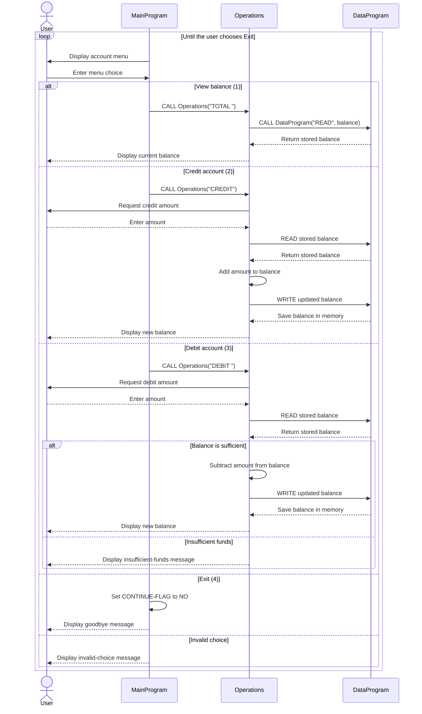

# COBOL Account Management System

This directory documents the COBOL account-management example in `src/cobol`.
The program provides a console menu for viewing a student account balance and
crediting or debiting that balance.

## COBOL Files

### `main.cob`

Defines `MainProgram`, the interactive entry point. It displays the account
management menu, accepts a choice from 1 through 4, and delegates account work
to `Operations`:

- `1` calls `Operations` with `TOTAL ` to display the current balance.
- `2` calls `Operations` with `CREDIT` to add money.
- `3` calls `Operations` with `DEBIT ` to subtract money.
- `4` exits the menu loop.

Invalid menu choices display an error and return to the menu.

### `operations.cob`

Defines `Operations`, the business-logic module. It accepts a six-character
operation code and handles three actions:

- `TOTAL ` reads and displays the stored balance.
- `CREDIT` reads an amount, adds it to the balance, saves the result, and
  displays the new balance.
- `DEBIT ` reads an amount, checks available funds, subtracts it when allowed,
  saves the result, and displays the new balance.

The module keeps a working balance initialized to `1000.00`, but the persisted
value is maintained by `DataProgram`.

### `data.cob`

Defines `DataProgram`, the simple account-data layer. It stores one balance in
working storage, initialized to `1000.00`, and accepts a six-character
operation code through linkage data:

- `READ` copies the stored balance into the caller's balance field.
- `WRITE` replaces the stored balance with the caller's balance field.

The value is in memory only, so it resets to `1000.00` whenever the program is
started again.

## Student Account Business Rules

- Every new run starts with a balance of `1000.00`.
- A credit increases the current balance by the entered amount.
- A debit is completed only when the current balance is greater than or equal
  to the requested amount.
- A debit that exceeds the current balance is rejected with
  `Insufficient funds for this debit.` and does not change the stored balance.
- Successful credits and debits write the updated balance back through
  `DataProgram`.
- The current implementation does not validate transaction amounts. Zero or
  negative values may therefore be accepted according to COBOL numeric input
  behavior; validation should be added if student-account policy requires
  positive amounts.
- There is one shared in-memory balance rather than separate student records
  or student identifiers.

## Application Data Flow

